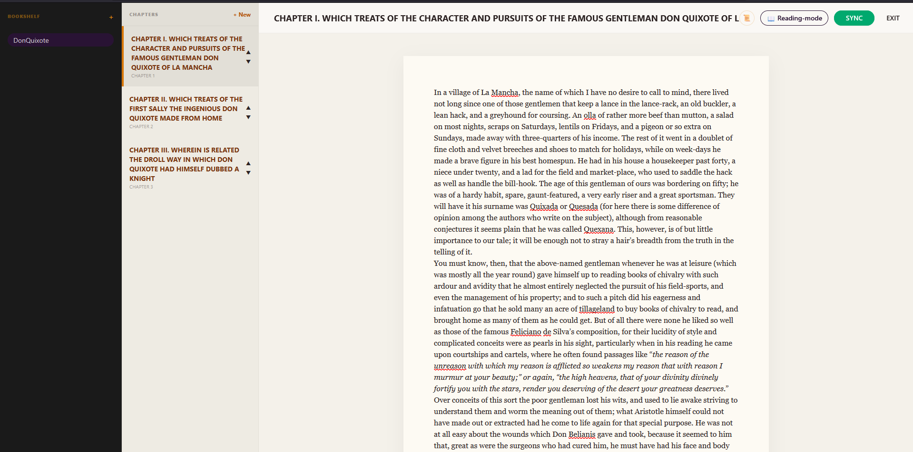
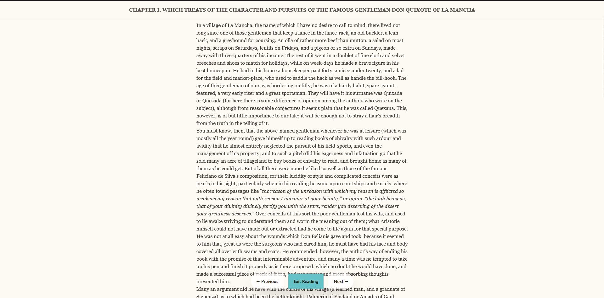
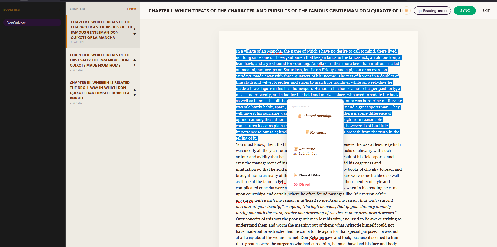
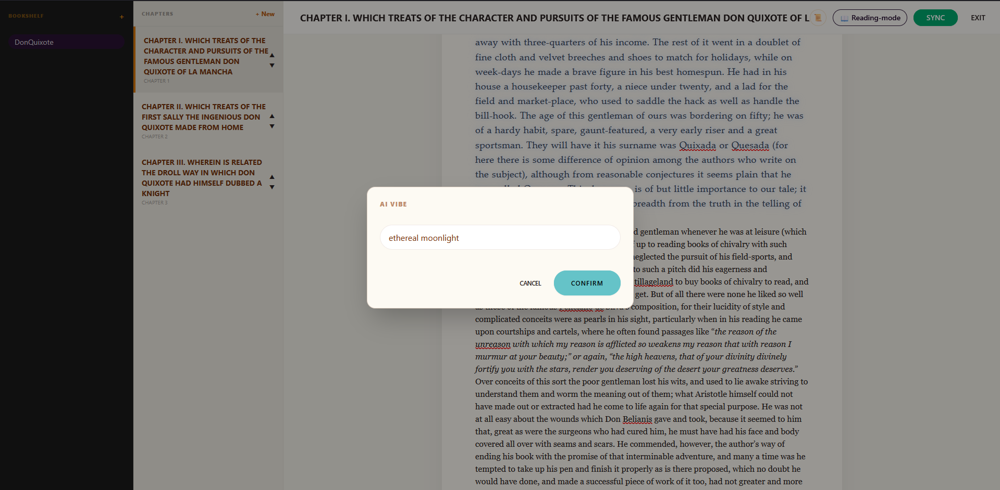

## 01. OVERVIEW
NOVEL_AI_STYLIST is a web-based online journal built with FastAPI and Vanilla JS. It uses Google's Gemini AI to automatically generate CSS styles for text. Instead of writing code, users can simply describe a visual effect (e.g., "burning paper"), and the application applies the corresponding style to the story.

## 02. PREVIEW

### Digital Interface
| Writing Desk (Editor) | Reading Mode |
| :---: | :---: |
|  |  |

### AI Spell Casting Workflow
| Step 1: Select & Incant | Step 2: AI Generated Style |
| :---: | :---: |
|  |  |

## 03. HOW TO USE

### 🔐 Authentication
* **One-Screen Access:** The Login and Registration forms are unified.
* **First Time:** Enter your desired username/password and click **REGISTER**.
* **Returning:** Enter your credentials and click **UNLOCK** to enter your Grimoire.

### 🪄 Casting Spells (The Workflow)
1.  **Select Text:** Highlight any phrase or paragraph in the editor.
2.  **Right Click:** Open the context menu and select **"✨ New AI Vibe"**.
3.  **Prompt:** Describe the look you want (e.g., *"glowing runic text"*, *"blood-stained parchment"*).
4.  **Save:** If you like the result, open the spellbook (next to the reading mode) to save it.
5.  **Equip:** Open your Spellbook and "Equip" up to 3 favorite spells for quick access in the right-click menu.

## 04. TECH STACK
* **Frontend:** Vanilla JavaScript, HTML5, CSS3 (Served via FastAPI).
* **Backend:** Python 3.11, FastAPI.
* **Database:** PostgreSQL (Production), SQLite (Local).
* **Cloud & AI:** Render Cloud, Google Gemini API.

---

## SETUP

### Application
1.  Clone the repository.
2.  Create a `.env` file in the root directory with your `GEMINI_API_KEY`, `DATABASE_URL`, and `SECRET_KEY`.
3.  Create a virtual environment: `python -m venv .venv`.
4.  Install dependencies: `pip install -r requirements.txt`.
5.  Run the server: `uvicorn app.main:app --reload`.

### Database
* The application uses **SQLAlchemy** to automatically generate tables (`grimoire_users`, `grimoire_books`, etc.) upon the first startup. No manual migration scripts are required for initial setup.

## DEMO
1.  **Deploy link:** https://novel-ai-stylist.onrender.com/
    * *Note: The first request may take 50 seconds to wake up the free-tier server.*
2. **Youtube link:** https://youtu.be/0UydhOzHOTA
